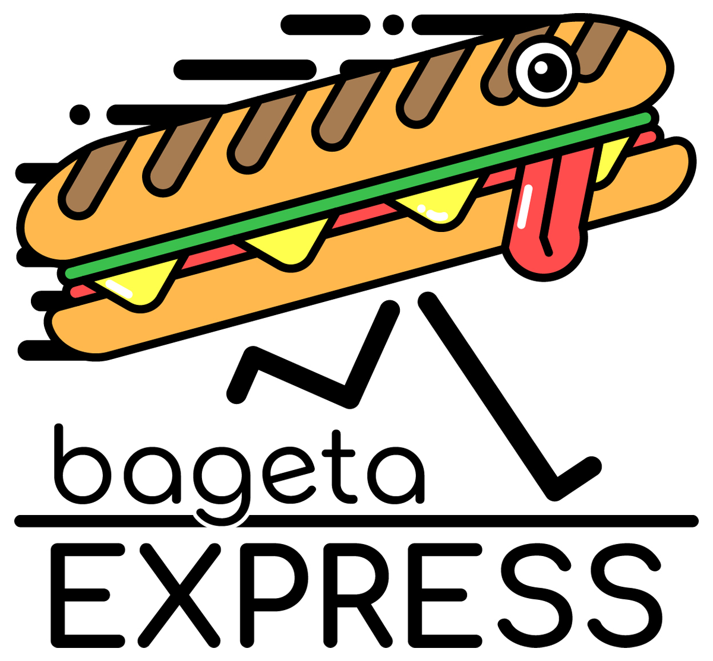

# Bageta Express - Effortless School Snack Ordering

Bageta Express is a web application tailored for students by students, offering a seamless way to order baguettes from third-party suppliers, all with direct delivery to your school. Our user-friendly platform showcases a catalog of baguette types, making it easy to select and place your orders.

## Key Features:

- **Simplified Ordering:** Explore a wide variety of available baguette types in our catalog, and place your order with ease.

- **Supplier Efficiency:** Suppliers benefit from efficient order management, catalog editing, and the ability to set order time windows.

- **Swift Order Identification:** Our unique QR code and PIN pairing system ensures quick order identification, streamlining order pickup.

- **Powered by Unicorn:** Bageta Express is built using the uuApp framework by Unicorn, a leading technology company. Our collaboration with Unicorn significantly contributes to the development and management of this project.

## Location:

- Bageta Express is currently located in Slovakia, specifically in the Košický region, Spišská Nová Ves.

## Future Plans:

- We are committed to enhancing the user experience and functionality of Bageta Express. Future plans include adding new features, improving performance, and expanding to new schools.

**Open to Collaboration:**

- Bageta Express is open to collaboration with new suppliers and schools interested in our platform. We welcome partnerships to provide students with even more options and convenience.

### Under Construction:

- Currently, the app is undergoing extensive redevelopment. We are in the process of rewriting it in React without using the uuApp framework, aiming to deliver an even better experience.

### License:

This application is protected under a restrictive license. Unauthorized use, modification, or distribution is prohibited without explicit written permission from the project maintainers.

## Development and Usage

See following guidelines:

- [uuAppg01Devkit Documentation](https://uuapp.plus4u.net/uu-bookkit-maing01/e884539c8511447a977c7ff070e7f2cf/book)
- [uuSubApp Instance Descriptor](https://uuapp.plus4u.net/uu-bookkit-maing01/289fcd2e11d34f3e9b2184bedb236ded/book/page?code=uuSubAppInstanceDescriptor)
- [uuApp Server Project (NodeJs)](https://uuapp.plus4u.net/uu-bookkit-maing01/2590bf997d264d959b9d6a88ee1d0ff5/book/page?code=getStarted)
- [uuApp Client Project (UU5)](https://uuapp.plus4u.net/uu-bookkit-maing01/ed11ec379073476db0aa295ad6c00178/book/page?code=getStartedHooks)
